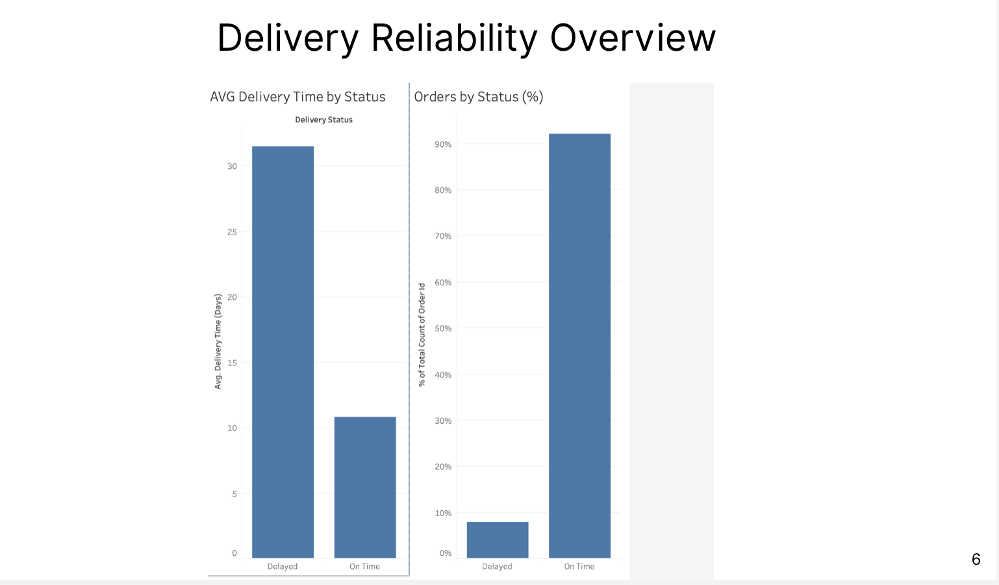
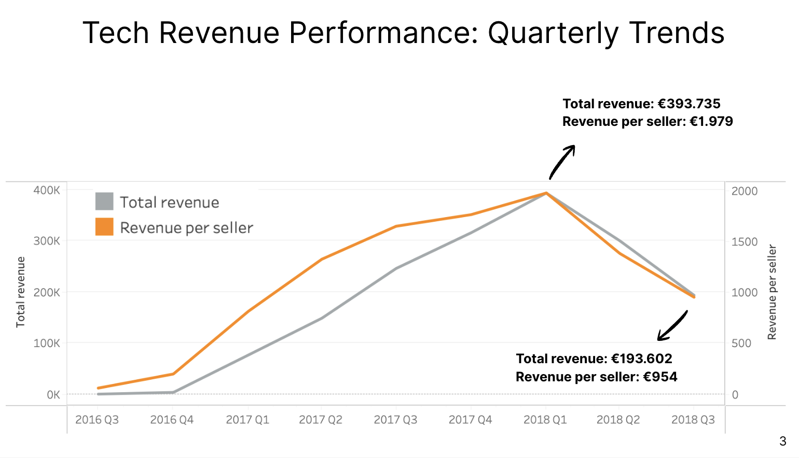

# 📦 E-Commerce Delivery & Sales Analysis

## 🎯 Business Problem

An e-commerce company is evaluating whether to expand its technology product line.

Key questions:
- Is there strong and sustainable demand for tech products?
- What drives delivery performance and customer satisfaction?

👉 Objective: Deliver actionable insights to support a data-driven expansion decision.

---

## 📊 Dataset

- Source: Magist e-commerce dataset  
- ~100,000 orders  
- Time period: 2016–2018  
- Data includes: orders, products, sellers, customers, payments, reviews  

---

## ⚙️ Tools & Skills

- SQL (data cleaning, joins, aggregations)
- Tableau (dashboarding & storytelling)
- Data Analysis (EDA, business insights)

---

## 🔍 Key Insights

### 📦 Delivery Performance



- ~92% of orders delivered on time  
- Delayed orders take ~3x longer (~30 vs ~10 days)  
- Delivery delays strongly impact customer experience  

---

### 📈 Revenue Trends



- Rapid growth from 2017 → early 2018  
- Peak reached in 2018 Q1  
- Decline afterwards introduces uncertainty  

⚠️ Important:
- Root cause cannot be confirmed with available data  
- Possible factors: competition, pricing, marketing, operations  

---

## 📊 Summary Insights

- Strong demand for technology products  
- Customers are price-sensitive → mid-range performs best  
- Delivery is generally reliable, but delays are critical  
- Growth is not clearly stable → risk in expansion  

---

## 💼 Business Recommendation

- Focus expansion on **mid-range tech products**
- Prioritize **reducing extreme delivery delays**
- Maintain logistics performance while improving consistency  

⚠️ Risk:
- Revenue decline requires validation before scaling  
- Further analysis needed (costs, competition, marketing)

---

## 💻 SQL Example (Proof of Work)

```sql
SELECT 
    order_status,
    AVG(DATEDIFF(order_delivered_customer_date, order_purchase_timestamp)) AS avg_delivery_time
FROM orders
GROUP BY order_status;
